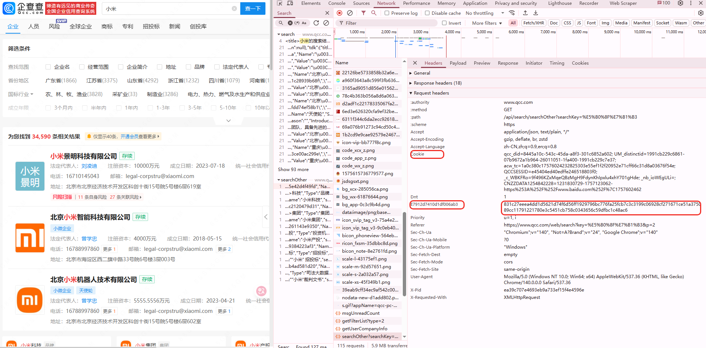
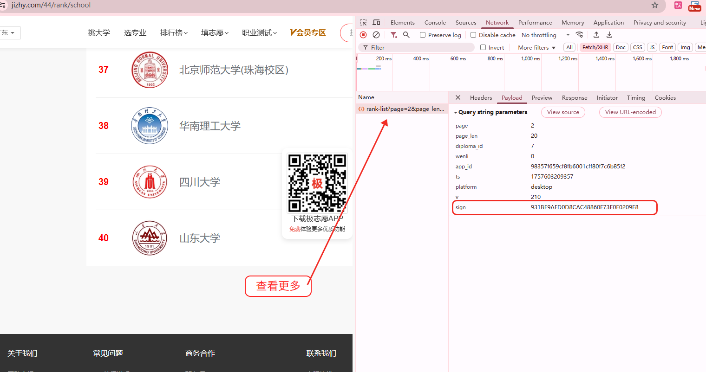
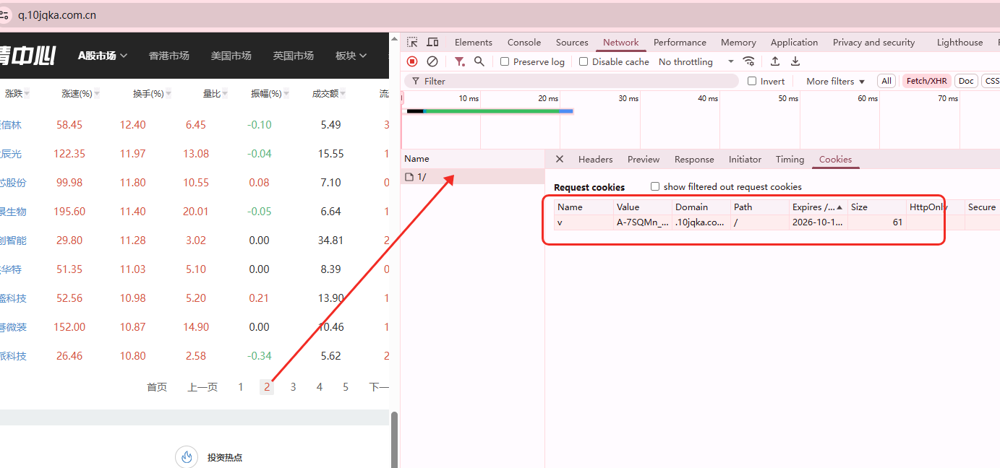
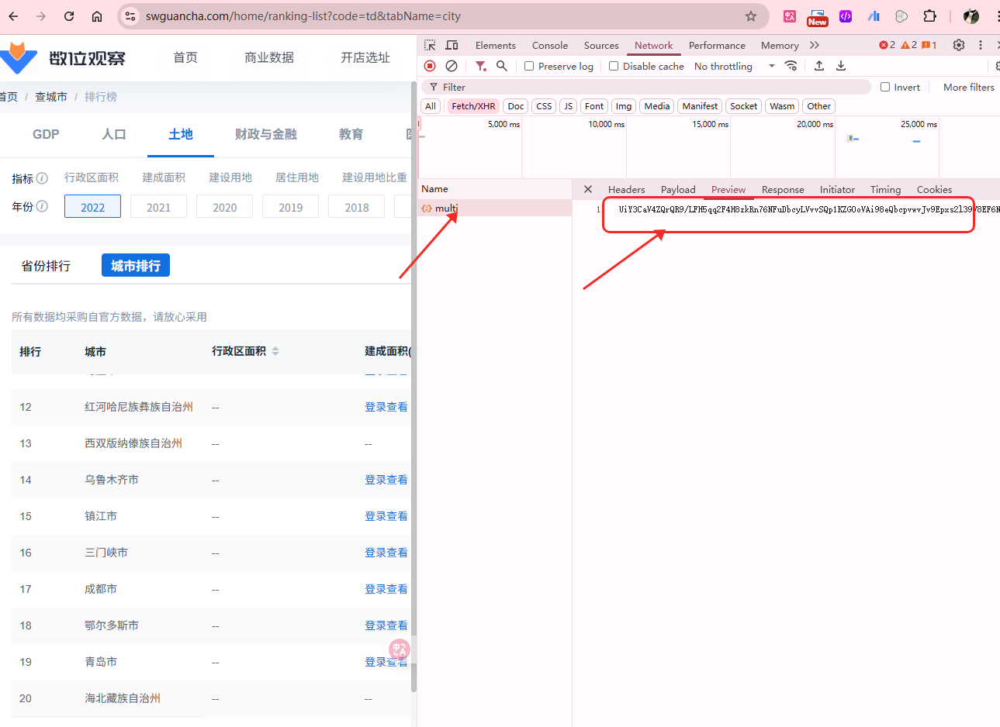
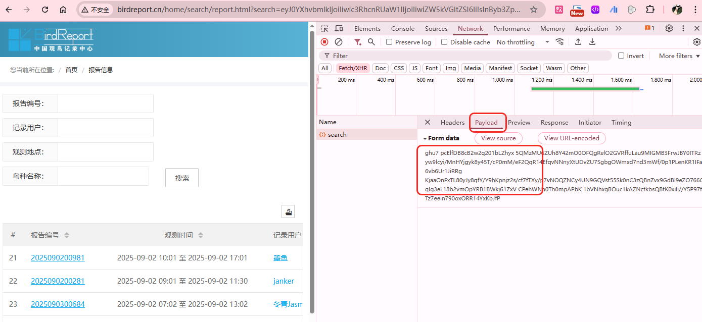
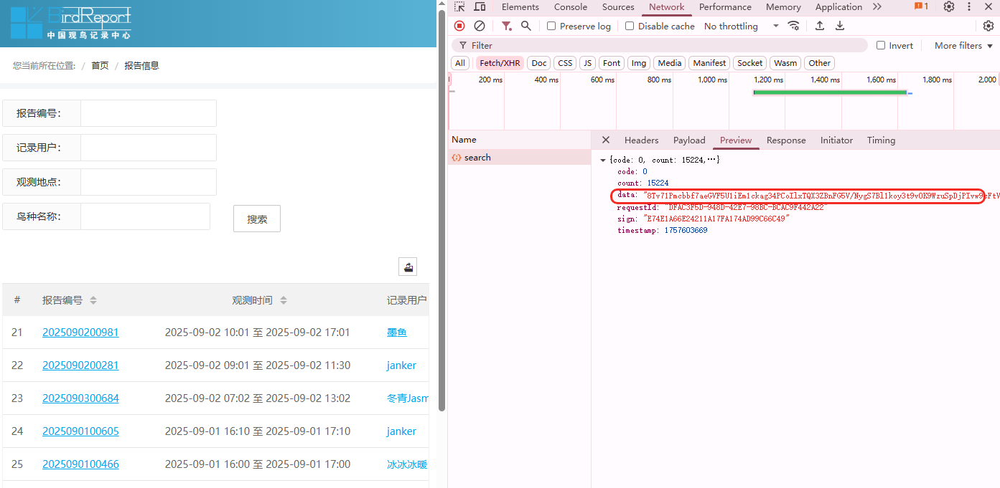
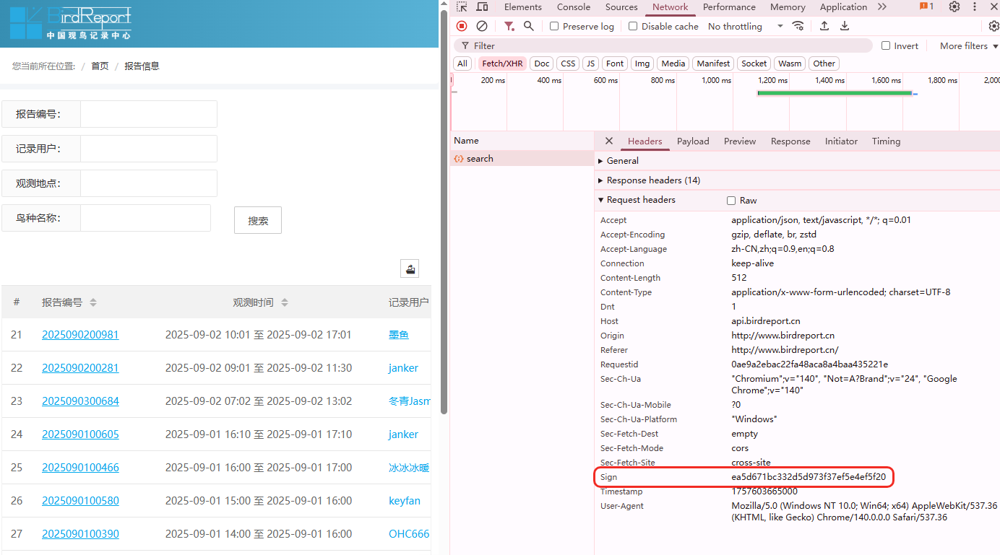
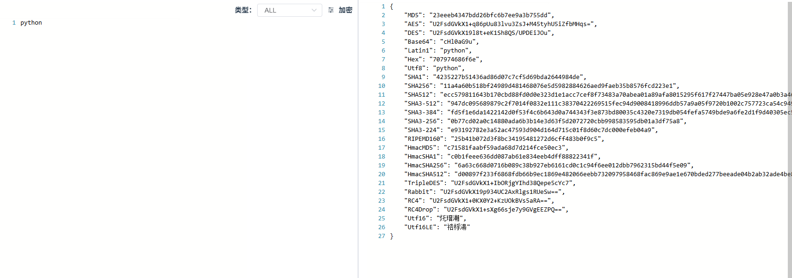

# 1. **技术准备**

1. Python 基础语法
2. **爬虫基础功底**
3. **JavaScript** 基础语法知识

# 2. 工具准备

**NVM**是管理**Node.js**版本的工具，功能类似Python的**Conda**。课程要求安装**Node.js 16版本**，其他版本（如18、20、22）因语法兼容性问题可能导致代码报错。

**需要自行安装** `nvm`

`nvm`全名：`node.js management`，顾名思义是一个 `node.js` 的版本管理工具。

通过它可以安装和切换不同版本的 `nodejs`。

**下载地址：**[https://github.com/coreybutler/nvm-windows/releases](https://github.com/coreybutler/nvm-windows/releases)

安装包: 当前提供的安装包是 Windows 版本的,需解压使用。

如果使用的是Macos系统的同学请使用 brew install nvm指令安装

# 3. NVM 指令

`nvm `基础指令：

* `nvm list`：列出所有已安装的 `node`
* `nvm install 16`：安装指定版本的 `node`，`16`指的是 `node`版本
* `nvm use 16`：切换到指定的 `node`版本，`16`指的是 `node`版本，若需要切换到其他版本则修改版本号

安装并配置成功之后可直接使用 Pycharm 执行 JavaScript 脚本，Pycharm 会自动识别已安装的 node 环境。

# 4. 什么是逆向

JavaScript逆向，包括两个过程，**（1）加密方式；（2）还原加密。**

1. JavaScript 加密：通常指的是在JavaScript中使用各种加密技术和算法来保护数据的安全性或者对敏感信息进行加密处理的过程。**接触各种加密手段：sha1\sha256\md5\AES\RSA，学习第三方包的调用 。
2. JavaScript 逆向：工程是指对JavaScript代码进行反向工程的过程。在软件开发中，逆向工程通常是指对已有的软件、程序或代码进行分析和理解，以获取它们的设计、功能和工作原理的过程。**通过断点的方式，让程序单步执行，了解正向流程，并进行逆向。逆向严重依赖断点，了解栈堆信息。**

**注意：JavaScript 逆向并不是把网站的加密信息还原成文明数据,而是根据网站上的加密(解密)的代码,我们通过python代码模拟出来。逆向并不是通过密文能反推出明文（算法是没有办法能反推出来的）**

## 4.1 存在加密的原因

1. 数据传输安全： 在Web应用程序中，客户端和服务器之间的通信可能涉及敏感数据，如用户身份验证信息、支付信息等。通过使用加密技术，可以确保这些数据在传输过程中不被窃听或篡改。
2. 客户端数据保护： 在客户端，有时需要对一些敏感信息进行本地存储，例如用户凭据、令牌等。通过使用前端加密技术，可以增加这些本地存储的安全性。
3. 密码安全： 当涉及用户密码时，最佳实践是在服务器上存储密码的哈希值而不是明文密码。然而，有时需要在客户端进行一些密码处理，比如在注册或登录时进行密码哈希。使用前端加密库可以确保这些操作在客户端的安全性。
4. 数字签名和身份验证： 在一些场景中，需要确保数据的完整性和来源。
5. 加密算法研究和实验： 有时，开发人员可能对加密算法进行研究或实验，以了解它们的工作原理、性能和适用性。

## 4.2 加密方式

### （1）请求头加密

注意：需要去观察，请求头中的参数生成过程。一般是 js 生成的，需要完成：

* 参数的定位
* 参数生成的过程（断点，单步执行，用 python 或者 js 复写代码）

ajax 会把这些参数给后端，进行对比（权限、中间件），后端决定是否给数据。

https://www.qcc.com/web/search?key=%E5%B0%8F%E7%B1%B3&p=2

### （2）请求参数加密

注意：携带了查询字符串。v,sign怎么来的？

**https://www.jizhy.com/44/rank/school**

### （3）cookie 加密

加密的数据是不可逆的，我们的目的是如何加密，然后模仿算法，完成cookie的加密，然后去请求。

**https://q.10jqka.com.cn/**

### （4）响应数据加密

服务器给的数据是加密过的，前端是如何解密渲染的？我们要扣代码 or 复现模拟。

https://www.swguancha.com/home/ranking-list?code=td&tabName=city

### （5）全加密

全加密是指： 请求头 + 参数 + cookie + 响应数据加密 等等加密方式组合起来。

**http://www.birdreport.cn/home/search/report.html?search=eyJ0YXhvbmlkIjoiIiwic3RhcnRUaW1lIjoiIiwiZW5kVGltZSI6IiIsInByb3ZpbmNlIjoi6Z2S5rW355yBIiwiY2l0eSI6IiIsImRpc3RyaWN0IjoiIiwicG9pbnRuYW1lIjoiIiwidXNlcm5hbWUiOiIiLCJzZXJpYWxfaWQiOiIiLCJjdGltZSI6IiIsInRheG9ubmFtZSI6IiIsInN0YXRlIjoiIiwibW9kZSI6IjAiLCJvdXRzaWRlX3R5cGUiOjB9**

## 4.3. 加密特征

每种加密方式都有一定的特征，所以可以找到加密方式。

https://spidertools.cn/#/crypto

# 5. js 学习目标

综上，我们的目标是学习js，能够看懂基本js代码，然后可以定位参数位置，已经逐步调试加密。
