# 1. 学习目标:

1. 熟悉开发者工具的使用
2. 熟悉代码断点的方式
3. 熟悉网页debugger实现方式

# 2. 浏览器开发者工具

## 2.1. 元素面板

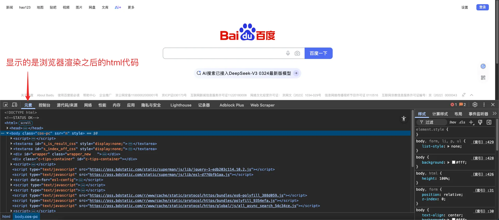

## 2.2. 网络面板

**浏览器请求的数据都会加载到网络面板**

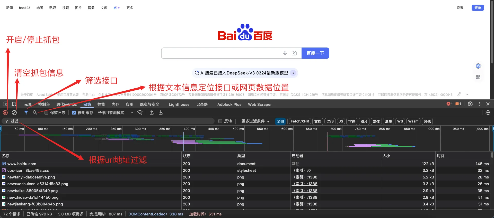

## 2.3. 控制台面板

**可以在控制台调试代码, 代码执行完成后可以** `ctrl + L `清空代码

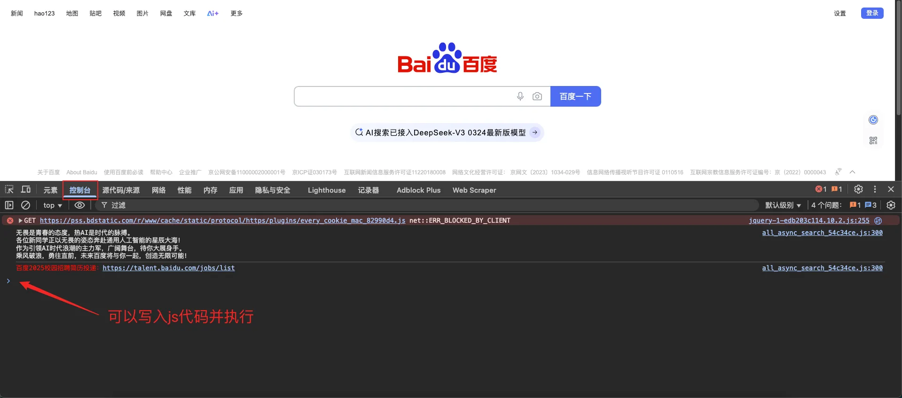

## 2.4. 源代码面板

**网页：当前网站加载的源代码位置**

**工作区：用不到，前端工程师会用**

**替换：替换网站代码信息，访问网站的时候，就是走的自己替换的文件**

**代码段：可以编写测试代码**

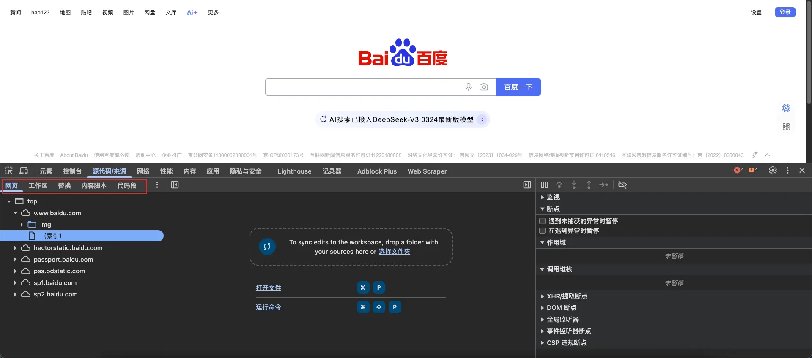

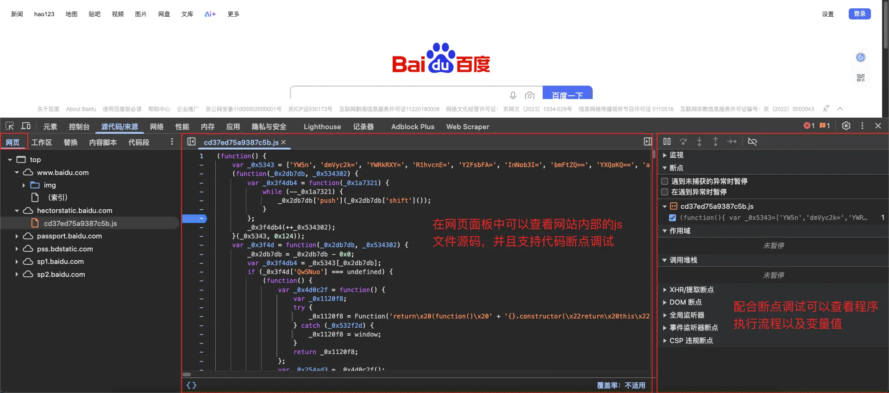

## 2.5. 替换功能

利用源代码面板（替换功能）显示自定义信息

1. **在任意盘符下创建文件夹用于保存自定义替换文件（可以在桌面创建）**
2. **在替换面板选中新建的文件夹**

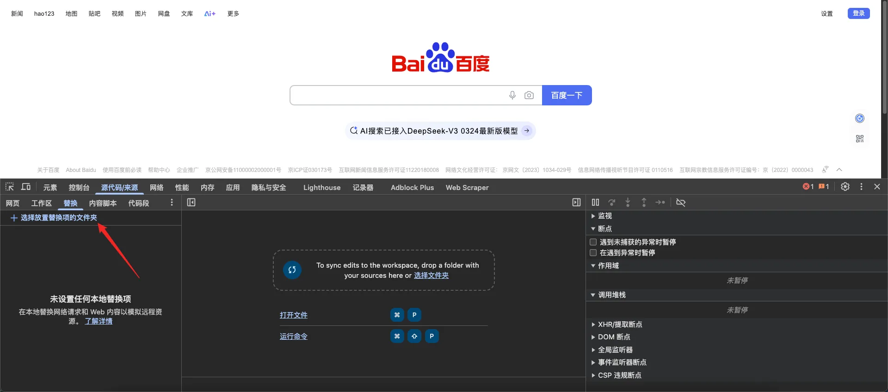

3. **选中替换的文件夹后点击允许**

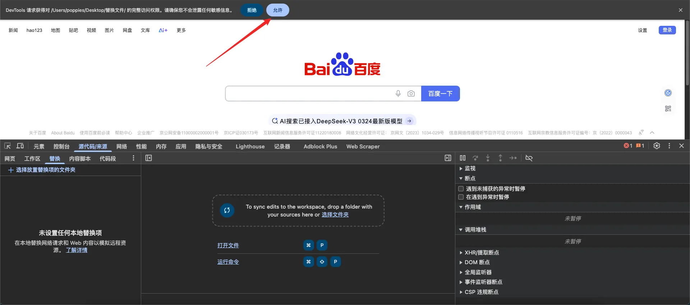

4. **选择你要替换的文件并在来源面板中打开**

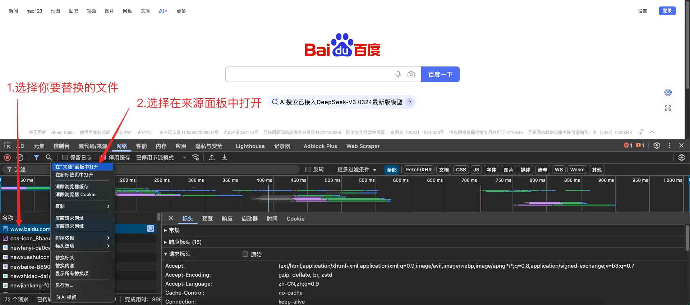

5. **修改文件内容并保存到本地**

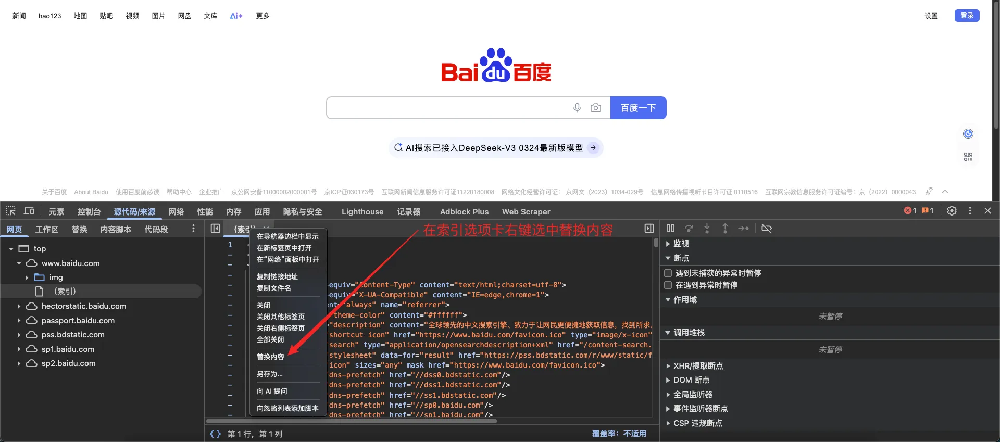

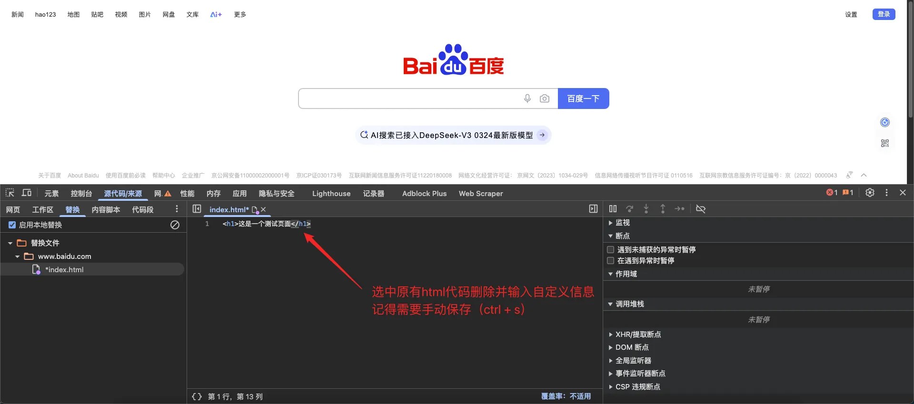

## 2.6. 应用面板

**用来查看和删除** `cookie `信息

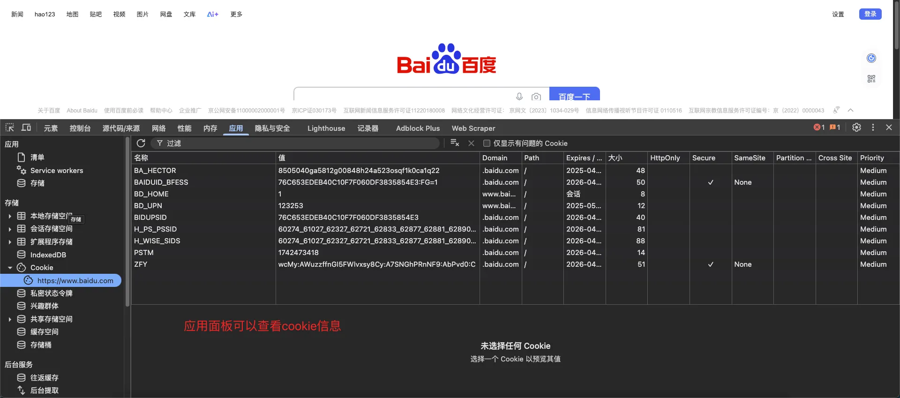
