# 1. 学习目标

1. 熟悉开发者工具的使用；
2. 熟悉代码断点的方式，熟悉正向开发方式；
3. 熟悉网页debugger实现方式。

# 2. 浏览器开发者工具

## 2.1. 元素面板

元素面板中的代码和服务器上的 html 代码是不一样的。

## 2.2. 网络面板

**浏览器请求的数据都会加载到网络面板，注意：一般停用缓存。**

### 2.2.1. 过滤 url

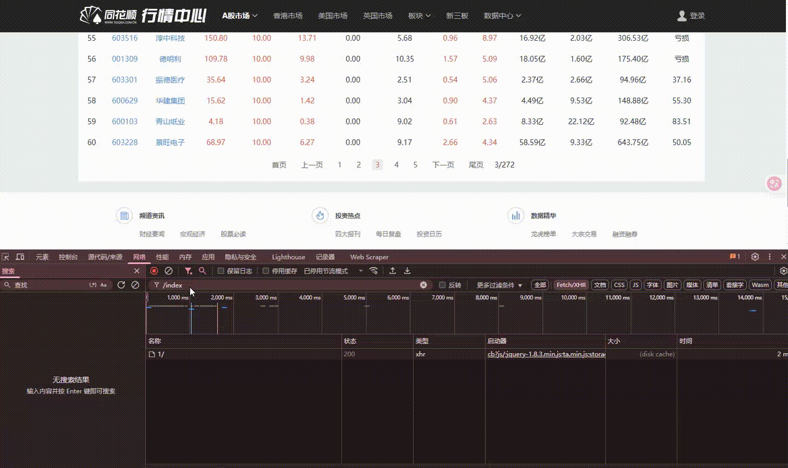

### 2.2.2 查询 api 包内部数据

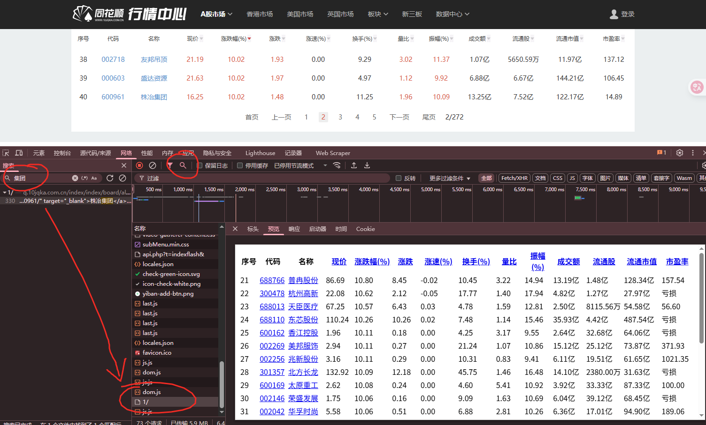

## 2.3. 控制台面板

**可以在控制台调试代码, 代码执行完成后可以** `ctrl + L `清空代码

## 2.4. 源代码/来源面板

1. **网页：当前网站加载的源代码位置。**
2. **工作区：逆向用不到，前端工程师会用。**
3. **替换：替换网站代码信息，访问网站的时候，就是走的自己替换的文件（过 debugger 的时候有用）**
4. 内容脚本：下载的插件（xpath、翻译、自己写一些脚本），当访问网页的时候可以自动执行。
5. **代码段：可以编写测试代码。（主要用于 hook）**

### 2.4.1 替换功能

利用源代码面板（替换功能）显示自定义信息

1. **在任意盘符下创建文件夹用于保存自定义替换文件（可以在桌面创建）**
2. **在替换面板选中新建的文件夹**

3. **选中替换的文件夹后点击允许**

4. **选择你要替换的文件并在来源面板中打开**

5. **修改文件内容并保存到本地**

过程：

### 2.4.2. 代码段

可以编写测试代码。（主要用于 hook）

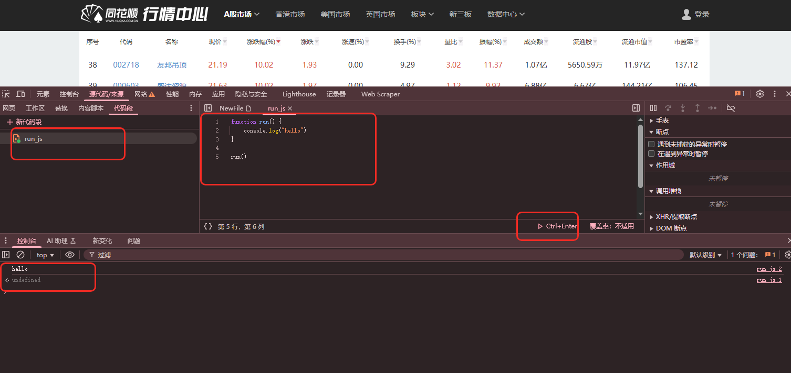

### 2.4.3. 断点调试

再网络中找到一个js文件，然后再来源中打开，打上断点，然后刷新网络，网页会在打断点的地方暂停。

图标从左至右依次介绍：

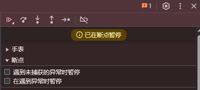

1. 暂停/恢复脚本执行（Pause/Resume script execution）：
   * 图标通常显示为暂停（||）或播放（▶）。
   * 当脚本正在运行时，点击暂停（||）会中断脚本的执行，停在当前执行的代码行或下一个断点处。
   * 当脚本因断点或debugger; 语句暂停时，图标会变为播放（▶），点击它会恢复脚本执行，直到遇到下一个断点或脚本执行完毕。
2. 跳过下一个函数调用（Step over next function call）：
   * 图标通常是一个向下弯曲的箭头越过一个点 (↷) 。
   * 当执行暂停在包含函数调用的一行时，点击此按钮会执行该函数调用，然后暂停在同一层级的下一行代码。它不会进入被调用函数的内部。
3. 进入下一个函数调用（Step into next function call）：
   * 图标通常是一个向下的箭头指向一个点 (↓) 。
   * 当执行暂停在包含函数调用的一行时，点击此按钮会进入被调用函数的第一行代码处暂停。如果当前行没有函数调用，则行为类似下一步。
4. 跳出当前函数（Step out of current function）：
   * 图标通常是一个向上的箭头指离一个点 (↑) 。
   * 当执行暂停在某个函数内部时，点击此按钮会继续执行该函数的剩余部分，然后在调用该函数的那一行代码的下一行暂停。
   * 注意：程序是从上到下执行，所以这边是把当前的函数的逻辑都执行完毕。
5. 单步调试，下一步（Step）：
   * 图标通常是一个向右的箭头指向一个点 (→•) 。
   * 点击此按钮会执行下一条代码语句，然后暂停。如果下一条语句是函数调用，它可能会进入该函数（行为有时类似进入）。
6. 停用/启用所有断点（Deactivate/Activate breakpoints）：
   * 图标通常是一个带有斜线的断点标记。
   * 点击此按钮可以临时禁用所有已设置的断点，再次点击则重新启用它们。
   * 这在你想要让代码完整运行一次而不停在任何断点处时很有用，但又不想逐个移除断点。

### 2.4.4. 更多断点方法

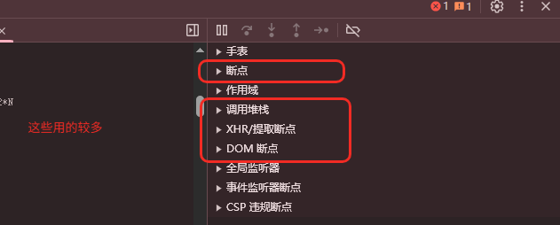

#### 2.4.4.1. 监视

https://oauth.d.cn/auth/goLogin.html

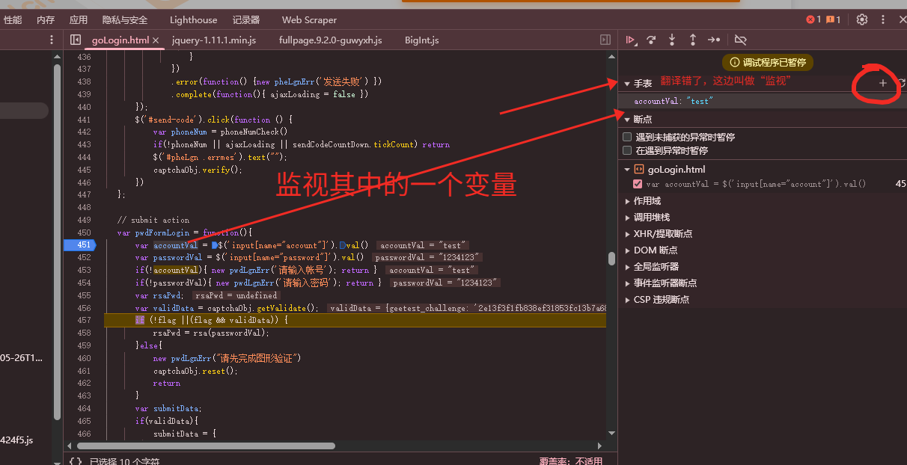

#### 2.4.4.2. 作用域

https://oauth.d.cn/auth/goLogin.html

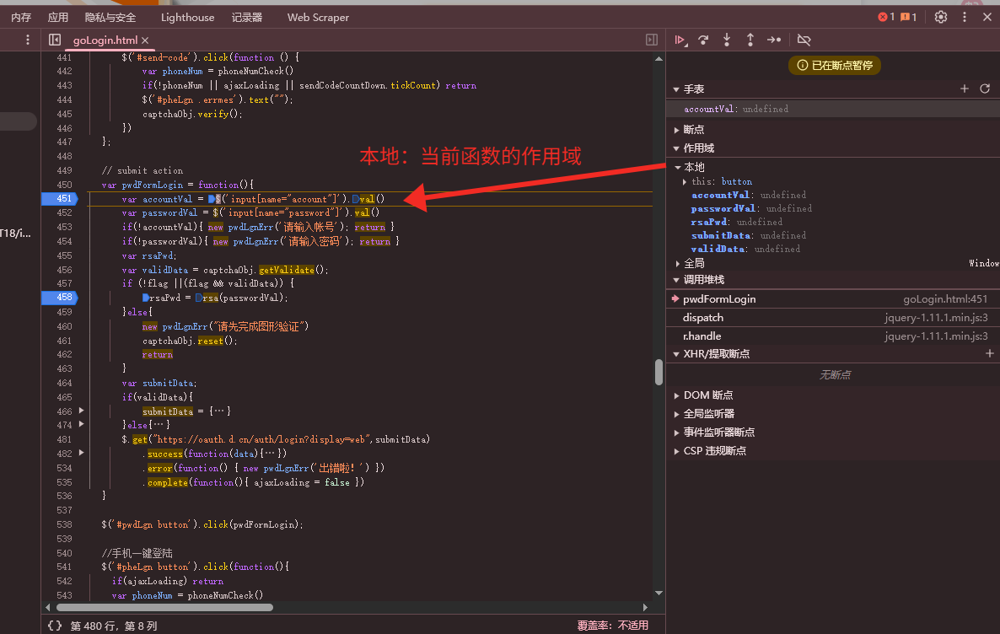

#### 2.4.4.3. 调用堆栈

栈结构：线性表，特征：先进后出。有点像“叠盘子”。

堆结构：二叉树

虽然叫“调用堆栈”，浏览器主要是查看“栈”。

**调用栈是解析器的一种机制，可以在脚本调用多个函数时，通过这种机制，我们能够追踪到哪个函数正在执行，执行的函数体又调用了哪个函数。**

* **当脚本要调用一个函数时，解析器把该函数添加到栈中并且执行这个函数。**
* **任何被这个函数调用的函数会进一步添加到调用栈中，并且运行到它们被上个程序调用的位置。**
* **当函数运行结束后，解释器将它从堆栈中取出，并在主代码列表中继续执行代码。**

#### 2.4.4.4. dom 断点

DOM 事件断点定位加密位置

* DOM事件断点是在浏览器的开发者工具中提供的一种调试工具，用于暂停JavaScript执行当特定类型的DOM事件。
* 使用DOM事件断点，你可以指定在哪些DOM事件上设置断点，比如点击（click）、改变（change）、加载（load）等。一旦设置了DOM事件断点，当相应的事件被触发时，浏览器会自动在触发事件的JavaScript代码行上暂停执行，从而允许你检查当前的程序状态、变量值，以及执行堆栈信息等。
* **执行的比较靠前，距离加密函数比较远**

#### 2.4.4.5. 事件监听

找到按钮里面绑定的js，一个个去断点，也可以找到加密位置。

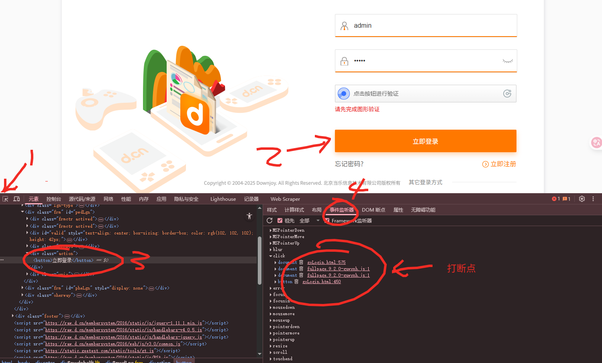

#### 2.4.4.6. XHR 断点

XHR 断点定位加密位置

* xhr断点是在浏览器的开发者工具中设置的一种调试工具，用于在进行网络请求时暂停JavaScript执行。
* **执行比较靠后，距离加密函数相对较近，可以根据栈快速定位**
* 注意：非xhr发送的接口就无法断点

网站加载时间轴
加载HTML -> 加载JS -> 运行JS初始化 -> 用户触发某个事件 -> 调用某段JS -> 加密函数 -> 给服务器发信息（XHR-SEND）-> 接收到服务器数据 -> 解密函数（如果数据加密的话） -> 刷新网页渲染

案例：找到登录接口，发现密码加密了。https://oauth.d.cn/auth/goLogin.html

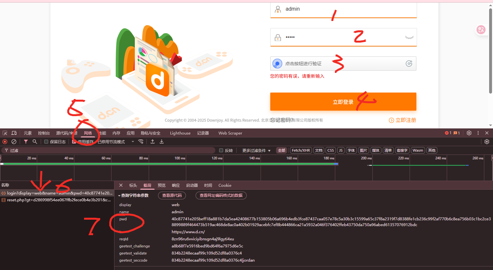

找密码加密位置，方法一：搜索。比较慢。

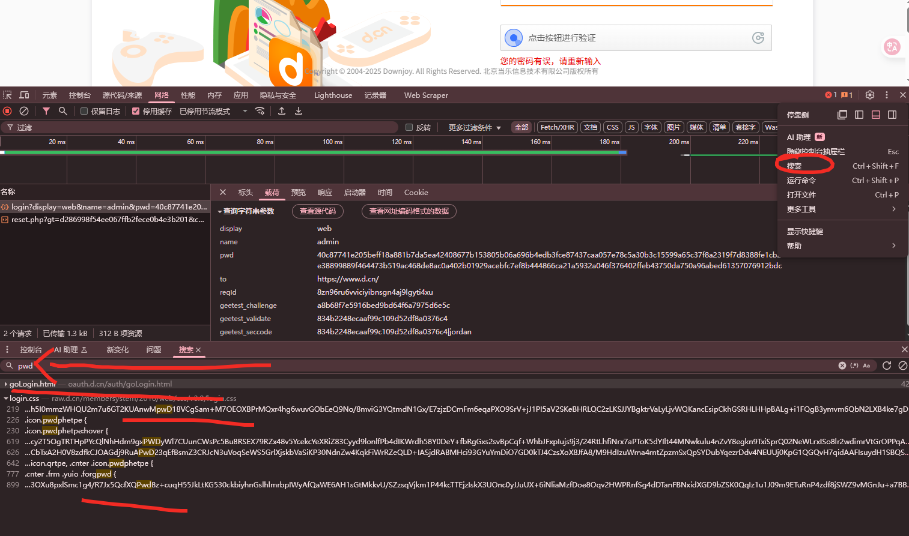

用xhr断点找，比较快的定位。https://oauth.d.cn/auth/goLogin.html

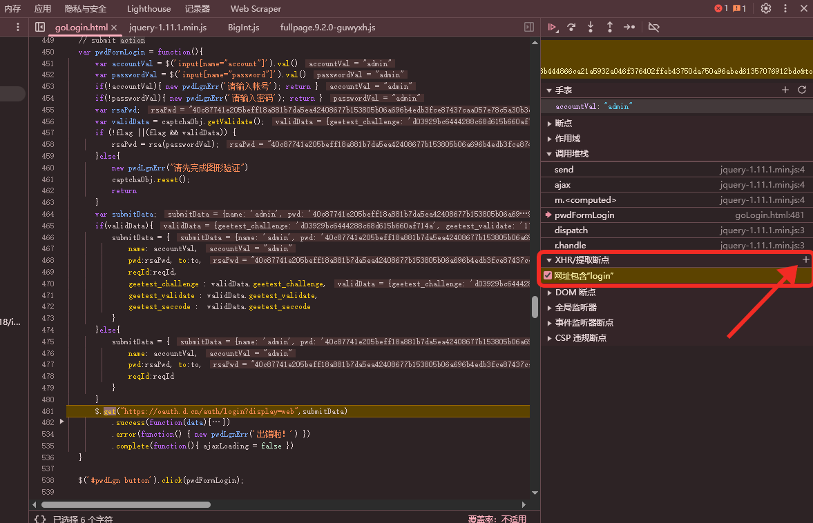

## 2.6. 应用面板

**用来查看和删除** `cookie `信息

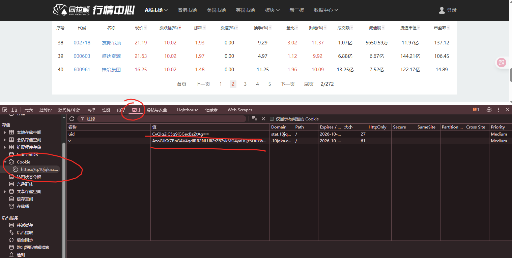
